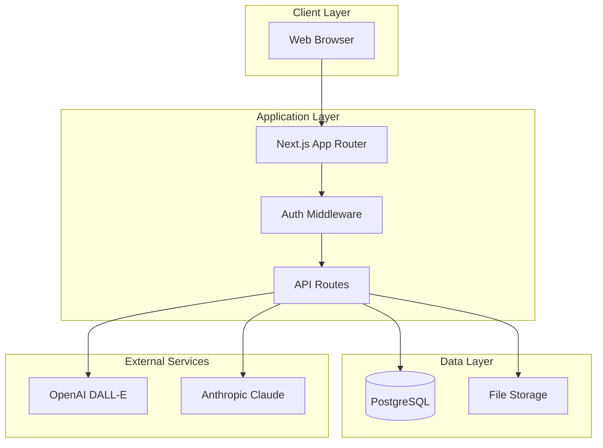
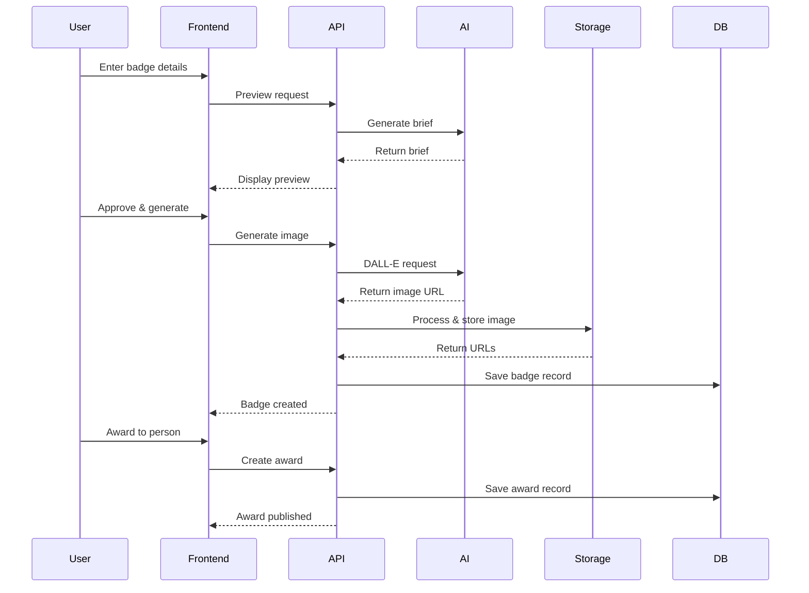

# Architecture Documentation

## Overview

Badges with Personality is a Next.js application that generates AI-powered achievement badges for celebrating project milestones. The system combines modern web technologies with AI services to create unique, shareable digital awards.

## System Architecture



## Core Components

### 1. Frontend (Next.js App Router)

The application uses Next.js 15 with the App Router for optimal performance and SEO.

#### Key Pages:
- `/` - Landing page
- `/admin/create` - Badge creation wizard (protected)
- `/admin/awards` - Award management (protected)
- `/hof` - Hall of Fame (public)
- `/a/[permalink]` - Individual award pages (public)
- `/login` - Admin authentication

#### Design Principles:
- Server Components by default for better performance
- Client Components only for interactivity (e.g., ShareButton)
- Responsive design with Tailwind CSS
- Optimistic UI updates

### 2. Authentication System

Cookie-based authentication for admin users.

```typescript
// Authentication Flow
1. User submits admin key at /login
2. Server validates key against ADMIN_KEY env variable
3. Sets httpOnly cookie with 7-day expiration
4. Middleware checks cookie on protected routes
5. Redirects to login if unauthorized
```

#### Security Features:
- httpOnly cookies prevent XSS attacks
- Secure flag in production
- SameSite=strict for CSRF protection
- Server-side validation

### 3. Database Design

PostgreSQL database with four main tables:

```sql
badges
├── id (UUID, PK)
├── slug (TEXT, UNIQUE)
├── name (TEXT)
├── style_key (TEXT)
├── prompt (TEXT)
├── model_used (TEXT)
├── seed (INT)
├── image_blob_url (TEXT)
├── thumb_blob_url (TEXT)
├── created_by (TEXT)
└── created_at (TIMESTAMPTZ)

people
├── id (UUID, PK)
├── name (TEXT)
├── handle (TEXT)
├── title (TEXT)
├── avatar_url (TEXT)
└── created_at (TIMESTAMPTZ)

projects
├── id (UUID, PK)
├── name (TEXT)
├── short_desc (TEXT)
└── created_at (TIMESTAMPTZ)

awards
├── id (UUID, PK)
├── badge_id (UUID, FK → badges)
├── person_id (UUID, FK → people)
├── project_id (UUID, FK → projects)
├── citation (TEXT)
├── public_permalink (TEXT, UNIQUE)
└── created_at (TIMESTAMPTZ)
```

#### Database Access Patterns:
- Connection pooling via `pg` library (local) or `@vercel/postgres` (production)
- Parameterized queries to prevent SQL injection
- Indexed lookups on slugs and permalinks

### 4. Badge Generation Pipeline



### 5. Image Processing

Images are processed through Sharp for optimization:

1. **Full Image**: 1024x1024 PNG with transparency
2. **Thumbnail**: 512x512 WebP at 90% quality

Storage strategy:
- **Development**: Local filesystem in `/public/badges/[slug]/`
- **Production**: Vercel Blob storage with public URLs

### 6. AI Integration

#### OpenAI (Required)
- Model: DALL-E 3
- Purpose: Generate badge images
- Style presets: Round Medal, Shield Crest, Ribbon Plaque

#### Anthropic Claude (Optional)
- Model: Claude 3
- Purpose: Enhance badge descriptions and briefs
- Fallback: System works without Claude

### 7. API Routes

All API routes are in `/app/api/`:

```
/api/auth                  - Authentication
/api/admin/preview-prompt  - Generate badge brief
/api/admin/generate-image  - Create badge with AI
/api/admin/publish-award   - Publish an award
/api/og                    - Dynamic OG images
```

## Data Flow

### Badge Creation Flow

1. **Input Phase**: Admin enters badge name, description, and style
2. **Preview Phase**: AI generates a brief with colors and concept
3. **Generation Phase**: DALL-E creates the badge image
4. **Storage Phase**: Image processed and stored
5. **Award Phase**: Badge awarded to recipient with citation

### Retrieval Flow

1. **Request**: User visits award page or Hall of Fame
2. **Query**: Database fetches award with joined badge/person/project data
3. **Render**: Server renders page with optimized images
4. **Cache**: Next.js caches for 60 seconds (revalidate period)

## Environment-Specific Configurations

### Local Development
- Database: Docker Postgres on localhost:5432
- Images: Stored in `/public/badges/`
- Auth: Relaxed security (no HTTPS requirement)
- Hot reload: Turbopack enabled

### Production (Vercel)
- Database: Vercel Postgres (Neon)
- Images: Vercel Blob storage
- Auth: Secure cookies with HTTPS
- Edge functions: Optimized routing

## Performance Optimizations

1. **Image Optimization**
   - Sharp processing for size reduction
   - WebP format for thumbnails
   - Lazy loading with Next.js Image

2. **Database**
   - Connection pooling
   - Indexed queries
   - Prepared statements

3. **Caching**
   - ISR with 60-second revalidation
   - Static generation for public pages
   - Client-side caching for API responses

4. **Bundle Size**
   - Dynamic imports for heavy components
   - Tree shaking with Turbopack
   - Minimal client-side JavaScript

## Error Handling

- Try-catch blocks in all API routes
- User-friendly error messages
- Fallback UI for loading states
- 404 handling for missing awards
- Validation at multiple layers

## Monitoring & Logging

- Console logs for debugging (development)
- Error boundaries for React components
- API response status codes
- Database query logging (development)

## Scalability Considerations

1. **Horizontal Scaling**: Stateless design allows multiple instances
2. **Database Pooling**: Connection limits managed
3. **Image CDN**: Static assets served from edge
4. **Async Processing**: Non-blocking image generation
5. **Rate Limiting**: Could be added at API gateway level

## Security Measures

1. **Authentication**: Admin-only badge creation
2. **Input Validation**: Zod schemas for type safety
3. **SQL Injection Prevention**: Parameterized queries
4. **XSS Protection**: React's built-in escaping
5. **CSRF Protection**: SameSite cookies
6. **Environment Variables**: Sensitive data isolated
7. **HTTPS**: Enforced in production

## Future Enhancements

Potential improvements for consideration:

1. **User Accounts**: Multi-user support with roles
2. **Badge Templates**: Reusable badge designs
3. **Batch Awards**: Award multiple people at once
4. **Analytics**: Track badge views and shares
5. **Webhooks**: Notify recipients of awards
6. **API Rate Limiting**: Prevent abuse
7. **Badge Verification**: Blockchain or cryptographic proof
8. **Export Options**: PDF certificates, social media formats